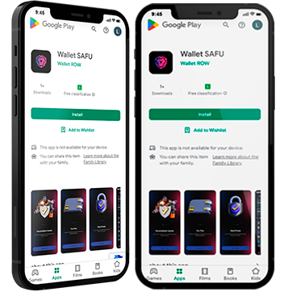

# ▫ About the Company

## _`WalletSAFU`_&#x20;

_`The developers of WalletSAFU have created digital wallets that provide complete security. Everyone can use our software to store and manage cryptocurrencies with ease. We respect, appreciate, and sincerely love blockchain technology. Our priority is the decentralization of WalletSAFU's software according to the basic principles of blockchain.`_

_`User privacy and anonymity are the main postulates for us, so we do not store your private keys, backup files or any other data on WalletSAFU servers. All your private data is stored only by you. Our wallet is lightweight, with a practical and intuitive interface.`_


`Our core values are privacy freedom and high-level security.`


<figure><figcaption></figcaption></figure>



<figure><figcaption></figcaption></figure>

_**`Privacy ->`**`We respect everyone and guarantee complete anonymity for our users.`_

<figure><figcaption></figcaption></figure>

_**`Security ->`**` ``We offer users exceptional security of their funds.`_

<figure><figcaption></figcaption></figure>

**`Decentralization ->`**` ``We fully support the decentralization of the network.`

<figure><figcaption></figcaption></figure>

**`Integrity ->`**_`We believe in a bright future for cryptography, and we are building it with everyone who joins us.`_

`-----------------------------------------------------------------------------`

## _`Leadership`_

_`The CEO of WalletSAFU has over 7 years of experience in the field of blockchain technologies and cryptocurrencies. In addition to being the principal visionary of WalletSAFU, the CEO's interests are focused on decentralization, custody-free cryptocurrency management, and privacy solutions.`_

_``_
