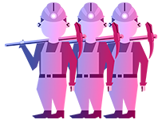

# ▫ PoW

<figure><figcaption></figcaption></figure>

#### _`To add each block to the chain, miners must compete to solve a difficult puzzle using their computers power.`_

<figure><figcaption></figcaption></figure>

#### _`In order to add a malicious block, you'd have to have a computer more powerful than 51% of the network.`_

<figure><figcaption></figcaption></figure>

#### _`The first miner to solve the puzzleis given a reward for their work.`_

\
\
\
