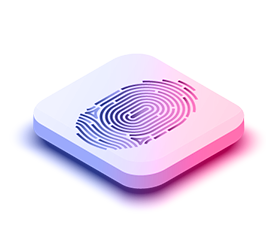

# ▫ Custodial Vs Non-Custodial.

_`A Non-Custodial wallet provides you with a full control of your funds. Only you are responsible for the security of your crypto assets. Non-custodial wallets don’t store private keys, backup files or any user data on its servers. The keys are encrypted and stored on the user’s devices.`_

<figure><figcaption></figcaption></figure>

_**`Only You Have Access ->`**` ``WalletSAFU allows users to fully own and manage their private keys and user data.`_

<figure><figcaption></figcaption></figure>

_**`Your funds are safe  ->`**` ``WalletSAFU has no control over your funds and private keys.`_

<figure><figcaption></figcaption></figure>

_**`Fast and simple crypto transactions ->`**`The free custody service makes managing your fund much easier and faster.`_

<figure><figcaption></figcaption></figure>

_**`Minimal Hacking Threat ->`**` ``In non-custodial wallets, private data is not stored on company servers, so the hacker threat is significantly reduced.`_\
_``_
